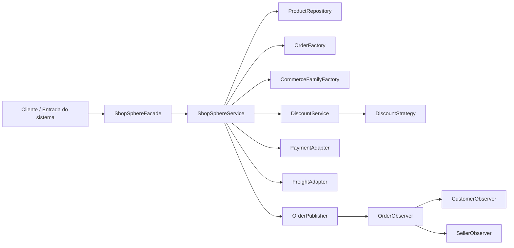

# Aula 05 — Componentes, conectores, configuração e modelagem

## Objetivo

Representar a estrutura do ShopSphere em componentes, suas ligações e configurações relevantes, relacionando o modelo arquitetural ao código existente.

## 1. Situação identificada

Durante a análise do ShopSphere, foi identificada a necessidade de representar como as principais partes do sistema estão organizadas e como elas se comunicam.

O projeto possui uma arquitetura em processo único, com uma fachada de acesso, um serviço responsável pela orquestração das operações, repositórios para acesso aos dados e adapters para integração com serviços externos.

A modelagem foi realizada para tornar essa estrutura mais clara e relacioná-la diretamente aos elementos existentes no código.

## 2. Problema / necessidade

O ShopSphere possui diferentes responsabilidades distribuídas entre classes e pacotes. Sem uma representação arquitetural, pode ser difícil identificar qual componente é responsável por cada operação e como as partes do sistema se comunicam.

A necessidade, portanto, é representar os principais componentes, suas responsabilidades e os conectores entre eles, mantendo coerência com a implementação atual.

## 3. Componentes principais

| Componente              | Responsabilidade                                                                                                  |
| ----------------------- | ----------------------------------------------------------------------------------------------------------------- |
| `ShopSphereFacade`      | Atua como ponto de acesso às operações do sistema, encaminhando as solicitações para o serviço de aplicação.      |
| `ShopSphereService`     | Orquestra as principais operações do marketplace, incluindo pedidos, descontos, pagamentos, frete e notificações. |
| `ProductRepository`     | Responsável pelo armazenamento e recuperação dos produtos.                                                        |
| `OrderFactory`          | Responsável pela criação de pedidos.                                                                              |
| `CommerceFamilyFactory` | Encapsula a criação de integrações relacionadas aos parceiros comerciais.                                         |
| `DiscountService`       | Coordena o cálculo de descontos utilizando uma estratégia de desconto.                                            |
| `DiscountStrategy`      | Define a estratégia utilizada para calcular descontos.                                                            |
| `OrderPublisher`        | Publica eventos relacionados às operações de pedido.                                                              |
| `OrderObserver`         | Define o mecanismo de observação dos eventos de pedido.                                                           |
| `CustomerObserver`      | Reage aos eventos de pedido relacionados ao cliente.                                                              |
| `SellerObserver`        | Reage aos eventos de pedido relacionados ao vendedor.                                                             |
| `PaymentAdapter`        | Isola a comunicação do sistema com o gateway de pagamento.                                                        |
| `FreightAdapter`        | Isola a comunicação do sistema com a integração de frete.                                                         |

## 4. Conectores e interações

Os principais conectores identificados são:

* `ShopSphereFacade` → `ShopSphereService`: encaminhamento das solicitações recebidas pelo sistema.
* `ShopSphereService` → `ProductRepository`: busca e armazenamento de produtos.
* `ShopSphereService` → `OrderFactory`: criação de pedidos.
* `ShopSphereService` → `DiscountService`: cálculo de descontos.
* `DiscountService` → `DiscountStrategy`: aplicação da estratégia de desconto.
* `ShopSphereService` → `PaymentAdapter`: comunicação com o serviço de pagamento.
* `ShopSphereService` → `FreightAdapter`: comunicação com o serviço de frete.
* `OrderPublisher` → `OrderObserver`: publicação e recebimento de eventos relacionados aos pedidos.
* `OrderObserver` → `CustomerObserver`: reação aos eventos relacionados ao cliente.
* `OrderObserver` → `SellerObserver`: reação aos eventos relacionados ao vendedor.

## 5. Diagrama arquitetural

## 6. Configuração relevante

A configuração relevante para a arquitetura atual está relacionada à forma como as integrações externas são utilizadas.

O ShopSphere possui integrações com serviços legados de pagamento e frete. Essas integrações são isoladas pelos adapters `PaymentAdapter` e `FreightAdapter`, evitando que os detalhes das APIs externas fiquem espalhados pelo restante da aplicação.

Também existe um mecanismo interno de publicação e observação de eventos de pedido por meio de `OrderPublisher` e `OrderObserver`.

A arquitetura permanece em um único processo e não depende atualmente de infraestrutura externa de mensageria ou de múltiplos serviços implantados separadamente.

## 7. Relação entre o modelo e o código

| Elemento do diagrama    | Pacote / classe / arquivo                             |
| ----------------------- | ----------------------------------------------------- |
| Fachada                 | `patterns/facade/ShopSphereFacade.java`               |
| Serviço de aplicação    | `service/ShopSphereService.java`                      |
| Repositório de produtos | `ProductRepository`                                   |
| Fábrica de pedidos      | `patterns/factory/OrderFactory.java`                  |
| Fábrica de integrações  | `patterns/abstractfactory/CommerceFamilyFactory.java` |
| Serviço de desconto     | `patterns/strategy/DiscountService.java`              |
| Estratégia de desconto  | `patterns/strategy/DiscountStrategy.java`             |
| Publicador de eventos   | `patterns/observer/OrderPublisher.java`               |
| Observador de eventos   | `patterns/observer/OrderObserver.java`                |
| Observador do cliente   | `patterns/observer/CustomerObserver.java`             |
| Observador do vendedor  | `patterns/observer/SellerObserver.java`               |
| Adapter de pagamento    | `patterns/adapter/PaymentAdapter.java`                |
| Adapter de frete        | `patterns/adapter/FreightAdapter.java`                |

## 8. Conclusão

A modelagem mostra que o ShopSphere possui uma organização em camadas dentro de um único processo. O `ShopSphereFacade` atua como ponto de entrada, o `ShopSphereService` concentra a orquestração das operações e componentes específicos isolam responsabilidades como persistência, desconto, criação de objetos, eventos e integrações externas.

Essa representação está alinhada à arquitetura atualmente adotada no projeto e serve como base para a análise dos estilos arquiteturais realizada na Aula 06.
