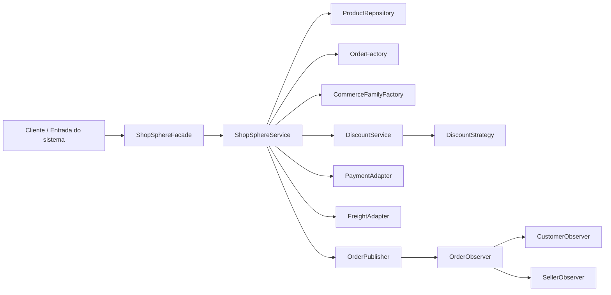

# Aula 07 — ADR, rastreabilidade e documentação arquitetural

## Objetivo

Documentar uma decisão arquitetural real do projeto ShopSphere e relacionar os requisitos do sistema com a decisão, os componentes envolvidos e as evidências produzidas durante as atividades.

## 1. Situação identificada

Durante a análise da arquitetura do ShopSphere, foi identificada a necessidade de definir como o sistema deveria organizar suas responsabilidades e componentes.

O projeto possui funcionalidades relacionadas a produtos, pedidos, estoque, pagamento, frete e notificações. Como o sistema ainda está em uma única aplicação e a equipe precisa evoluir o projeto de forma incremental, foi necessário avaliar diferentes estilos arquiteturais antes de manter a estrutura atual.

A situação foi analisada nas atividades das Aulas 05 e 06, considerando a arquitetura em camadas, uma alternativa orientada a eventos e uma alternativa baseada em microsserviços.

## 2. Problema / necessidade

O projeto precisava de uma arquitetura que permitisse:

* organizar as responsabilidades entre os componentes;
* manter o funcionamento atual do sistema;
* facilitar a manutenção do código;
* evitar a introdução de tecnologias e infraestrutura que não são necessárias neste momento;
* permitir futuras evoluções caso os requisitos do sistema mudem.

Também era necessário considerar requisitos não funcionais relacionados à segurança do pagamento, desempenho do frete, consistência do estoque, notificações e manutenção do sistema.

## 3. Alternativas consideradas

### Alternativa 1 — Arquitetura em camadas em um único processo

Manter a aplicação em um único processo, organizada principalmente entre fachada, serviço, repositórios e adaptadores.

**Benefícios:**

* menor complexidade operacional;
* aproveitamento da estrutura existente;
* menor custo de mudança;
* facilidade para a equipe trabalhar com o projeto atual.

**Custos e riscos:**

* `ShopSphereService` concentra várias responsabilidades;
* o crescimento do sistema pode aumentar o acoplamento;
* algumas integrações ainda precisam de maior isolamento.

### Alternativa 2 — Arquitetura orientada a eventos

Utilizar eventos para desacoplar partes do fluxo, principalmente pagamento, frete e notificações.

**Benefícios:**

* maior desacoplamento entre componentes;
* possibilidade de vários consumidores reagirem aos mesmos eventos;
* pode facilitar futuras evoluções assíncronas.

**Custos e riscos:**

* aumenta a complexidade;
* exige uma estratégia de comunicação entre componentes;
* pode exigir infraestrutura adicional;
* a necessidade desse nível de desacoplamento ainda não foi demonstrada pelo projeto.

### Alternativa 3 — Microsserviços

Separar o sistema em serviços independentes, por exemplo:

* catálogo/estoque;
* pedidos;
* pagamento;
* frete;
* notificações.

**Benefícios:**

* isolamento dos domínios;
* possibilidade de evolução e implantação independente;
* possibilidade de escalar partes específicas do sistema.

**Custos e riscos:**

* maior complexidade operacional;
* necessidade de comunicação entre serviços;
* maior dificuldade de testes e implantação;
* custo de manutenção maior para o estágio atual do projeto.

## 4. Decisão

Foi decidido **manter e evoluir a arquitetura em camadas em um único processo**, conforme registrado no ADR-0001.

A entrada do sistema permanece concentrada na `ShopSphereFacade`, enquanto a `ShopSphereService` realiza a orquestração das operações de negócio.

Os repositórios ficam responsáveis pelo acesso aos dados e os adaptadores isolam as integrações externas, como pagamento e frete.

Também são utilizados componentes como `DiscountService`, `DiscountStrategy`, `OrderPublisher` e os observers para organizar responsabilidades específicas.

Essa decisão foi escolhida porque atende ao estágio atual do projeto sem exigir uma infraestrutura adicional de mensageria ou múltiplos serviços implantáveis.

## 5. Consequências

### Positivas

* A equipe consegue evoluir o projeto de forma incremental.
* A estrutura atual do sistema pode ser aproveitada.
* As responsabilidades ficam organizadas entre componentes.
* Integrações externas podem ser isoladas por meio dos adaptadores.
* Não é necessário introduzir um broker de mensagens ou múltiplos ambientes de implantação.
* A arquitetura pode ser revisada futuramente caso os requisitos mudem.

### Negativas / Trade-offs

* `ShopSphereService` ainda concentra diversas operações de negócio.
* O sistema continua sendo executado em um único processo.
* A evolução para eventos ou microsserviços poderá exigir mudanças futuras.
* Alguns requisitos não funcionais ainda precisam de métricas e critérios de aceitação mais específicos.

## 6. Atualização do modelo arquitetural

A decisão mantém o modelo arquitetural apresentado na Aula 05:

Não foi necessária uma alteração estrutural no diagrama, pois a decisão da Aula 07 mantém a arquitetura definida nas Aulas 05 e 06.

## 7. Matriz de rastreabilidade

| Requisito                                                                | Decisão relacionada                                                                 | Componente / artefato                                                                        | Evidência                                      |
| ------------------------------------------------------------------------ | ----------------------------------------------------------------------------------- | -------------------------------------------------------------------------------------------- | ---------------------------------------------- |
| RF01 — Permitir criar pedido adicionando produtos com reserva de estoque | Manter arquitetura em camadas e centralizar a orquestração das operações no serviço | `ShopSphereService`, `Order`, `ProductRepository`                                            | Diagrama de componentes e diagramas da Aula 08 |
| RF02 — Realizar checkout com desconto, pagamento, frete e notificação    | Manter o serviço como responsável pela orquestração do fluxo de negócio             | `ShopSphereService`, `DiscountService`, `PaymentAdapter`, `FreightAdapter`, `OrderPublisher` | ADR-0001 e diagrama arquitetural               |
| RNF01 — Segurança no pagamento                                           | Isolar integração de pagamento por meio de um adaptador                             | `PaymentAdapter`                                                                             | ADR-0001 e código do projeto                   |
| RNF02 — Rapidez na cotação de frete                                      | Isolar integração de frete para permitir evolução da integração                     | `FreightAdapter`                                                                             | ADR-0001 e diagrama arquitetural               |
| RNF03 — Estoque correto                                                  | Manter a operação de estoque dentro do fluxo controlado do pedido                   | `ShopSphereService`, `Product`, `ProductRepository`                                          | RF01 e diagramas da Aula 08                    |
| RNF04 — Cliente recebe notificações                                      | Utilizar o mecanismo de publicação/observação existente                             | `OrderPublisher`, `OrderObserver`, `CustomerObserver`                                        | Diagrama arquitetural                          |
| RNF05 — Facilidade de manutenção e integração de novos transportadores   | Separar integrações externas por adaptadores e manter responsabilidades organizadas | `FreightAdapter`, `PaymentAdapter`, `ShopSphereService`                                      | ADR-0001 e Aula 05                             |

## 8. Evidências no GitHub

A atividade deve ser registrada no repositório do projeto por meio de:

* arquivo da atividade: `docs/atividadesMD/aula-07.md`;
* ADR relacionado: `docs/adr/ADR-0001-arquitetura.md`;
* commit contendo a documentação;
* Issue ou PR relacionado à atividade, quando utilizado pelo grupo.

## 9. Conclusão

A Aula 07 documenta a decisão arquitetural de manter a arquitetura em camadas em um único processo e estabelece a relação entre os requisitos do ShopSphere, os componentes responsáveis e os artefatos produzidos.

A decisão não impede mudanças futuras. Caso o volume, os requisitos de desempenho ou a necessidade de implantação independente aumentem, a arquitetura poderá ser reavaliada com base em novas evidências.
