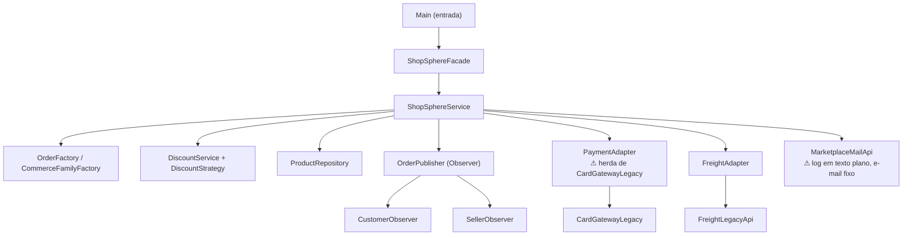
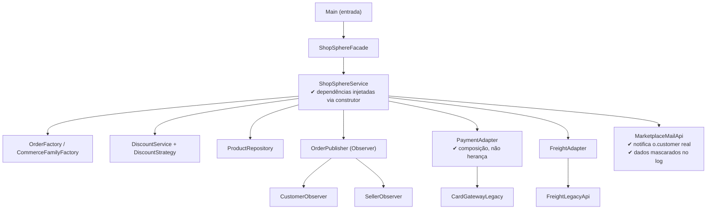

# Aula 06 — Atividade de Análise Arquitetural

## Objetivo

Comparar estilos arquiteturais e justificar escolhas a partir de requisitos funcionais e não funcionais do ShopSphere, especialmente segurança e desempenho, relacionando-os às decisões arquiteturais já tomadas.

> **Importante:** as classes citadas abaixo são as do próprio ShopSphere — nenhum nome foi copiado de outro projeto apenas para parecer semelhante ao exemplo de referência.

---

## 1. Identificação

- **Projeto:** ShopSphere — Marketplace (projeto acadêmico semestral)
- **Grupo:** ShopSphere
- **Integrantes:** Alice Ferreira do Nascimento, Antonio Silveira Peres Neto, Heloisa Rodrigues Mota, Lucas Almeida Santos
- **Data:** 10 de Setembro de 2026

---

## 2. Arquitetura atual

Consistente com `docs/adr/ADR-0001-arquitetura.md`, o ShopSphere adota uma arquitetura em camadas simples, executada em processo único, com chamadas síncronas diretas entre os componentes.

### 2.1 Estrutura identificada

- **Entrada:** `Main` inicializa a fachada e dispara as primeiras chamadas.
- **Fachada:** `ShopSphereFacade` concentra o acesso externo ao sistema.
- **Serviço de aplicação:** `ShopSphereService` orquestra criação de pedido, adição de item, checkout (desconto, pagamento, frete e notificação), chamando o repositório, os padrões de apoio e os adapters.
- **Repositório:** `ProductRepository` persiste os produtos.
- **Padrões de criação:** `OrderFactory` cria pedidos; `CommerceFamilyFactory` cria integrações com parceiros comerciais.
- **Padrão de estratégia:** `DiscountService` + `DiscountStrategy` calculam o desconto do pedido de forma substituível — mas hoje com regras fixas (`total>1000` e `productIds.size()>=3`) embutidas antes de consultar a estratégia.
- **Padrão de comportamento (Observer):** `OrderPublisher` notifica observers (`CustomerObserver`, `SellerObserver`) quando um evento de pedido ocorre.
- **Adapters para sistemas legados:** `PaymentAdapter` e `FreightAdapter` isolam a comunicação com o gateway de pagamento (`CardGatewayLegacy`) e a transportadora (`FreightLegacyApi`).
- **Notificações:** `MarketplaceMailApi` envia e-mail ao cliente.

### 2.2 Evidências no projeto

- Evidência 1: `service/ShopSphereService.java` — os campos `payment`, `freight`, `mail` são inicializados com `new CardGatewayLegacy()`, `new FreightLegacyApi()`, `new MarketplaceMailApi()` diretamente na declaração, em vez de recebidos por injeção de dependência (já registrado como o primeiro alvo de refatoração em `docs/adr/ADR-0001-arquitetura.md`).
- Evidência 2: `service/ShopSphereService.java`, método `checkout(String id)` — calcula desconto, cobra pagamento, cota frete, envia e-mail e publica evento, tudo de forma síncrona dentro do mesmo método, sem tratamento de exceção em torno de `payment.cobrar(...)` ou `freight.cotar(...)`.
- Evidência 3: `service/ShopSphereService.java`, método `checkout(String id)` — envia a notificação sempre para o e-mail fixo `"cliente@exemplo.com"`, em vez de `o.customer`, então nenhum cliente real recebe a notificação do próprio pedido.
- Evidência 4: `legacy/MarketplaceMailApi.java` — método `send(to, text)` imprime destinatário e texto via `System.out`, sem mascaramento nem canal criptografado.
- Evidência 5: `patterns/adapter/PaymentAdapter.java` — `extends CardGatewayLegacy` (herança direta da API legada, em vez de composição), expondo o método legado `cobrar(...)` como público por herança.
- Evidência 6: `patterns/observer/OrderPublisher.java` — mantém uma `List<OrderObserver> observers`, então todos os observers cadastrados (`CustomerObserver`, `SellerObserver`) são de fato notificados; este ponto **não** é um problema hoje.
- Evidência 7: `README.md` — confirma execução com `javac -d out ...` e `java -cp out br.edu.shopsphere.Main`, sem infraestrutura adicional.

### 2.3 Diagrama simplificado da arquitetura atual



---

## 3. Requisitos funcionais analisados

| ID | Requisito funcional | Evidência no projeto |
|---|---|---|
| RF01 | O sistema deve permitir montar um pedido adicionando produtos, reservando estoque no momento da adição. | `ShopSphereService.addItem(orderId, productId)` busca o produto, chama `Product.reserve()` (que lança `IllegalStateException` se `stock<=0`) e só então chama `Order.addProduct(productId, price)`. |
| RF02 | O sistema deve permitir finalizar a compra (checkout), aplicando desconto, cobrando o pagamento, cotando o frete e notificando o cliente. | `ShopSphereService.checkout(id)` chama `DiscountService.calculate(...)`, `payment.cobrar(...)`, `freight.cotar(...)`, `mail.send(...)` e `publisher.publish(id, "CHECKOUT_FINISHED")`. |

---

## 4. Requisitos não funcionais analisados

| ID | Requisito não funcional | Como pode ser verificado |
|---|---|---|
| RNF01 | Segurança: dados do cliente (e-mail, valor cobrado) não podem ser expostos em texto plano em logs; a integração com o gateway de pagamento deve ser isolada por composição, não por herança da API legada. | Revisão de código procurando PII em `System.out`; teste garantindo que `PaymentAdapter` não expõe métodos herdados de `CardGatewayLegacy`. |
| RNF02 | Desempenho: o fluxo de checkout (`checkout`) deve responder rapidamente sob carga normal, considerando que hoje todas as chamadas são síncronas e locais. | Teste de desempenho/benchmark sobre `ShopSphereService.checkout(...)`. |
| RNF03 | Confiabilidade: falha no pagamento ou na cotação de frete não pode deixar o pedido em estado inconsistente nem interromper silenciosamente a notificação ao cliente correto. | Teste unitário forçando `payment.cobrar(...)` a retornar erro e verificando que `o.status` fica `PAYMENT_ERROR` e o e-mail é enviado para `o.customer`, não para um endereço fixo. |
| RNF04 | Manutenibilidade: `ShopSphereService` deve receber suas dependências (pagamento, frete, notificação) por injeção, não instanciá-las diretamente, para permitir testar `checkout()` sem os serviços reais. | Revisão de código/teste de unidade instanciando `ShopSphereService` com dublês (mocks/fakes) das dependências. |

---

## 5. Relação RNF × parte da arquitetura

| RNF | Parte da arquitetura afetada | Justificativa |
|---|---|---|
| RNF01 | `legacy/MarketplaceMailApi.java`; `patterns/adapter/PaymentAdapter.java` | São os pontos onde dados do cliente saem do sistema ou são registrados — `MarketplaceMailApi.send(...)` imprime destinatário e texto via `System.out`, e `PaymentAdapter extends CardGatewayLegacy` propaga a API legada por herança em vez de encapsulá-la. |
| RNF02 | `service/ShopSphereService.java` | O método `checkout()` encadeia, na mesma thread, cálculo de desconto, cobrança, cotação de frete, envio de e-mail e publicação de evento, tudo de forma síncrona. |
| RNF03 | `service/ShopSphereService.java` | `checkout()` não trata exceção em torno de `payment.cobrar(...)`/`freight.cotar(...)` e envia a notificação para um e-mail fixo (`"cliente@exemplo.com"`) em vez de `o.customer`, então o cliente real nunca é avisado do resultado do próprio pedido. |
| RNF04 | `service/ShopSphereService.java` | Os campos `payment`, `freight`, `mail`, `discounts` e `publisher` são inicializados com `new` diretamente na declaração da classe, impedindo substituir essas dependências por dublês em teste — ponto já identificado em `docs/adr/ADR-0001-arquitetura.md`. |

---

## 6. Problema arquitetural identificado

### Problema identificado

O `docs/adr/ADR-0001-arquitetura.md` já registrava que `ShopSphereService` concentra pedido, pagamento, frete, desconto e notificação em uma classe só, dependendo diretamente das implementações legadas. A análise desta aula aprofunda esse ponto: além do acoplamento, o método `checkout()` notifica sempre o mesmo e-mail fixo e não trata falhas de pagamento/frete, o que compromete a confiabilidade da notificação ao cliente mesmo quando o pedido é processado com sucesso.

### Evidência

`service/ShopSphereService.java`, método `checkout(String id)`:
```java
mail.send(
    "cliente@exemplo.com",
    "Pedido " + id + " status " + o.status
);
```
O parâmetro `o.customer` (identificador do cliente real do pedido) nunca é usado para a notificação; qualquer pedido, de qualquer cliente, gera um e-mail para o mesmo endereço fixo. Além disso, nenhuma chamada em `checkout()` está protegida por `try/catch`, então uma exceção do gateway de pagamento ou da API de frete interromperia o método antes de `publisher.publish(id, "CHECKOUT_FINISHED")`, sem registro do que falhou.

### Consequência possível

O cliente pode nunca ser avisado sobre o resultado real do seu próprio pedido (pago, com erro de pagamento, etc.), mesmo que o processamento tenha ocorrido — um risco direto para RNF03 (confiabilidade) e para RNF04 do requisito original ("o cliente deve receber notificações", `docs/requisitos_iniciais.md`), silencioso porque o sistema não sinaliza esse desvio.

---

## 7. Alternativas arquiteturais

- **Alternativa A:** Manter a arquitetura atual em camadas simples, corrigindo os defeitos concretos encontrados (e-mail fixo, ausência de tratamento de falha, herança no `PaymentAdapter`, dependências instanciadas com `new`) e reforçando segurança nos logs.
- **Alternativa B:** Migrar para uma arquitetura orientada a eventos com message broker (fila/tópico), publicando e consumindo eventos de pedido (criado, pago, com erro de pagamento, frete cotado) de forma assíncrona.
- **Alternativa C:** Migrar para microsserviços por domínio (catálogo/estoque, pedido, pagamento, frete), comunicando-se via API.

---

## 8. Matriz de decisão arquitetural

A matriz completa (critérios, pesos, notas, cálculo `Peso × Nota` e totais) está no arquivo `MATRIZ-DECISAO.md`.

Resumo dos totais obtidos:

| Alternativa | Total |
|---|---:|
| A — Manter arquitetura atual | **49** |
| B — Arquitetura orientada a eventos | 36 |
| C — Microsserviços por domínio | 31 |

---

## 9. Justificativa das notas

As justificativas de cada nota atribuída na matriz (critério, alternativa, nota, motivo e evidência do projeto) estão detalhadas no arquivo `JUSTIFICATIVAS-NOTAS.md`.

---

## 10. Decisão arquitetural

### Alternativa escolhida ou mantida

**Alternativa A — manter a arquitetura em camadas simples**, confirmando e aprofundando a decisão já registrada em `docs/adr/ADR-0001-arquitetura.md` e `docs/adr/ADR-0002-encapsulamento.md`.

### Justificativa da decisão

A Alternativa A obteve a maior pontuação na matriz (49 contra 36 e 31), mas a escolha não se apoia só nisso: os problemas reais encontrados (e-mail de notificação fixo, ausência de tratamento de falha em pagamento/frete, herança em `PaymentAdapter`, dependências instanciadas com `new` em `ShopSphereService`) são falhas de implementação, corrigíveis dentro do próprio estilo em camadas, e não limitações do estilo em si. Migrar para eventos ou microsserviços aumentaria a complexidade operacional e o custo de manutenção para uma equipe pequena, recém-chegada ao legado e com prazo de semestre, sem que exista hoje um requisito real de escala que justifique esse investimento — nenhuma evidência em `docs/arquitetura_inicial.md` sustenta a afirmação anterior de que o sistema já seria "preparado para microsserviços".

---

## 11. Trade-off

- **Ganho:** baixa complexidade operacional e baixo custo de manutenção — o sistema continua rodando com `javac`/`java -cp`, sem infraestrutura adicional, compatível com o prazo do semestre e com a estratégia de refatoração incremental já adotada em `docs/adr/ADR-0001-arquitetura.md`.
- **Custo ou consequência:** o sistema segue com um único processo síncrono; falha em pagamento ou frete continua exigindo tratamento cuidadoso dentro do próprio método `checkout()`, sem a reentrega automática que um broker de eventos ofereceria.
- **Trade-off aceito pelo grupo:** o grupo aceita abrir mão, por ora, de uma entrega de notificações mais resiliente via fila em troca de simplicidade e previsibilidade de custo, já que não há hoje volume de uso que justifique a infraestrutura adicional. Em compensação, o grupo se compromete a corrigir os problemas concretos encontrados (e-mail fixo, falta de tratamento de erro, herança no adapter, injeção de dependência em `ShopSphereService`) dentro da própria arquitetura atual.

---

## 12. Arquitetura proposta

A arquitetura é **mantida** em camadas simples. Os pontos destacados abaixo (✔) são as melhorias internas recomendadas — nenhuma delas muda o estilo arquitetural.



Pontos preservados: fachada única, serviço de aplicação central, repositório em memória, uso dos padrões Factory/Strategy/Observer/Adapter. Pontos evoluídos internamente: injeção de dependência em `ShopSphereService` (em vez de `new` direto), composição (em vez de herança) em `PaymentAdapter`, notificação para o e-mail real do cliente (`o.customer`) com tratamento de falha de pagamento/frete, e mascaramento de dados sensíveis em `MarketplaceMailApi`. Caso surjam requisitos reais de escala ou resiliência mais adiante, a migração para eventos ou microsserviços deverá ser reavaliada em um novo ADR.

---

## 13. Conclusão

Foi identificado que a arquitetura em camadas do ShopSphere, já decidida em `docs/adr/ADR-0001-arquitetura.md`, apresenta problemas concretos de implementação: o método `checkout()` notifica sempre um e-mail fixo em vez do cliente real do pedido, não trata falhas de pagamento ou frete, `PaymentAdapter` herda diretamente da API legada em vez de compô-la, e `ShopSphereService` continua instanciando suas dependências com `new` em vez de recebê-las por injeção. Três alternativas foram comparadas em matriz de decisão ponderada — manter a arquitetura atual, migrar para eventos ou migrar para microsserviços — e a primeira obteve a maior pontuação (49 contra 36 e 31), sustentada por menor complexidade operacional e custo, sem abrir mão da possibilidade de corrigir os problemas encontrados dentro do próprio estilo. A decisão tomada foi manter a arquitetura em camadas, aplicando as melhorias internas descritas acima. Essa decisão é adequada ao projeto neste momento porque a equipe é pequena, está começando a conhecer o legado, o prazo é de um semestre e não há, hoje, requisito real de escala que justifique o custo e a complexidade de uma migração arquitetural.
