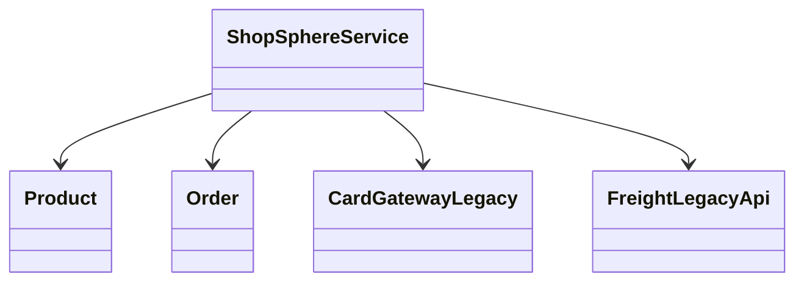
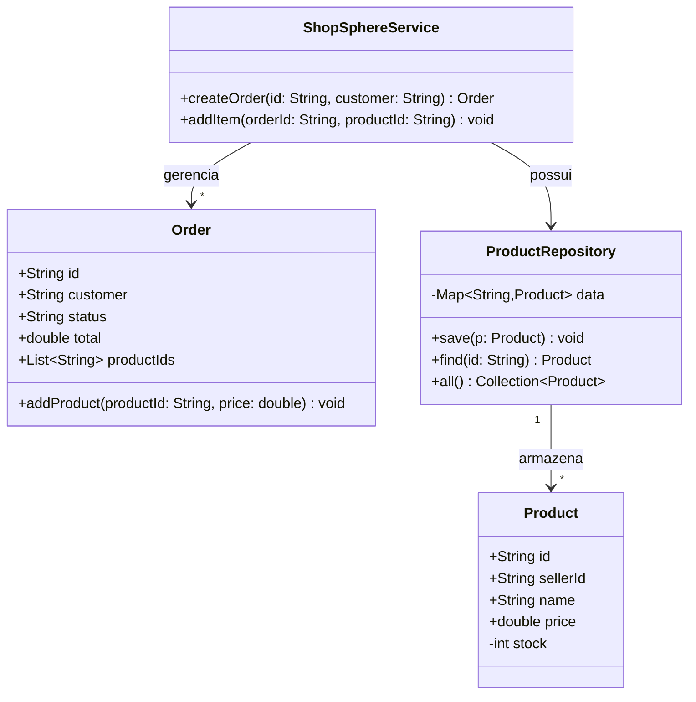
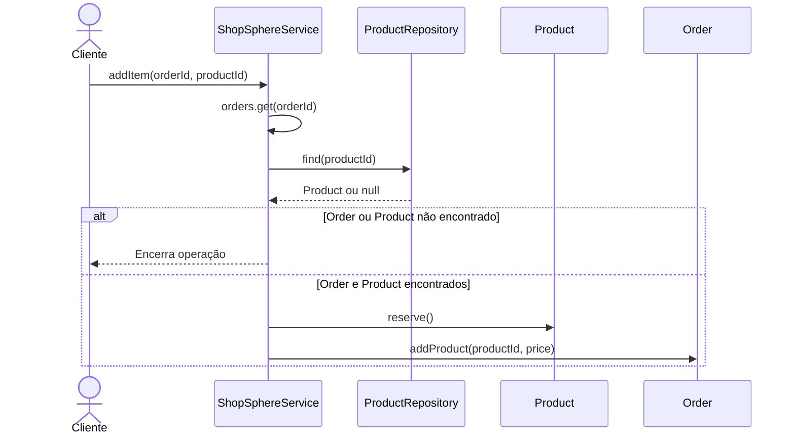
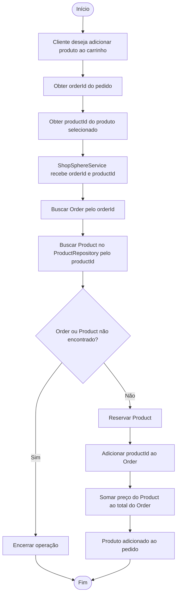

# Classes — visão parcial

# Adicionar produto no carrinho
## Diagrama de Classes

> `"1" --> "*"` significa que uma instância se relaciona com várias instâncias. 
1 = um * = vários (zero ou mais). O nome disso em UML é multiplicidade.

## Diagrama de Sequência

## Diagrama de Atividades

